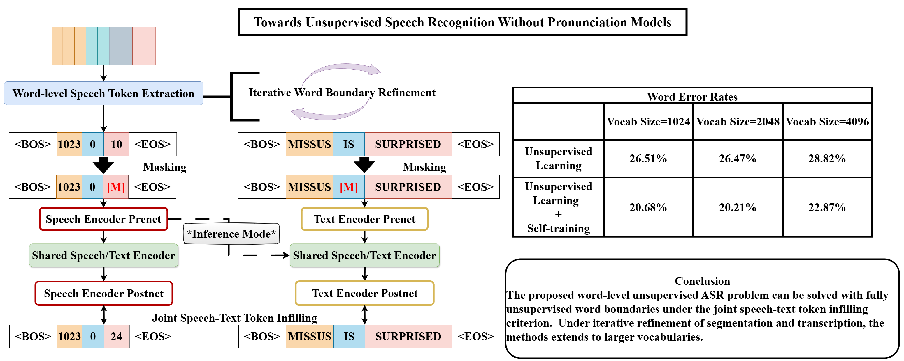

# Towards Unsupervised Speech Recognition Without Pronunciation Models
<div align="center">Junrui Ni, Liming Wang, Yang Zhang, Kaizhi Qian, Heting Gao, Mark
Hasegawa-Johnson, Chang D. Yoo</div>
<div align="center">University of Illinois Urbana-Champaign</div>
<div align="center">Korea Advanced Institute of Science and Technology
(KAIST)</div>
<div align="center">Massachusetts Institute of
Technology (MIT)</div>
<div align="center">MIT-IBM Watson AI Lab</div>

## Preprint
The work will be under review for possible publication. A preprint is available at: https://arxiv.org/abs/2406.08380



## Environment Setup
You may need several environments to support different repos.
As our code development is initially based on SpeecT5's repo (https://github.com/microsoft/SpeechT5/tree/main/SpeechT5), the main environment for this project should include all its dependecies. Here is a list of the main packages and their versions that are required for this main environment:
- fairseq (use v0.12.x, the closest version of fairseq that should be compatible with the current implementation)
- PyTorch (I use v1.9.0 and did not switch over the 2 years)
- faiss
- edit-distance
- editdistance
- kenlm
- npy_append_array
- espnet (for legacy reason)
- espnet-tts-frontend (for legacy reason)

This is not an exhaustive list, but should be enough to get you started.

You will need a separate environment for getting VG-HuBERT features/word segmentation. Follow this: https://github.com/jasonppy/word-discovery. Note that some modfications of the code has been provided in this to suit the needs of this project. In addition, install `npy_append_array`.

You may need a separate environment for running the GradSeg unsupervised word segmentation model: https://github.com/MLSpeech/GradSeg. Note that some modfications of the code has been provided in this to suit the needs of this project.

You will need a separate environment for running the wav2boundaries model, or XLS-R-based noisy word boundary finetuning: https://gitlab.cognitive-ml.fr/ralgayres/wav2boundaries.

If you wish to run wav2vec-U and REBORN, follow these two repos to configure the environment (I chose to basically incorporate the additional requirements):
https://github.com/facebookresearch/fairseq/tree/main/examples/wav2vec/unsupervised.


## Data Preparation
1. Download the LibriSpeech dataset (train-clean-100 & train-clean-360) from the official website: https://www.openslr.org/12/

2. Download the forced aligment data of the clean subset, together with file splits (including a set of files to discard during training/evaluation) from https://drive.google.com/drive/folders/1ztLjIShdRMwBaTkKTtJPmxIhWH0LNqVf?usp=sharing. We have already converted the forced alignments to a format that can be used by VG-HuBERT's repo.The original data is from https://github.com/CorentinJ/librispeech-alignments/tree/master.

3. Go to `SpeechT5/data_curation` and run `curate_with_n_words.py`. This script will concatenate forced-aligned speech segments that are within the vocabulary set together for each utterance. After that, run `create_three_sets.py`, which splits the forced alignment data into three sets, and `create_tsvs.py`, which creates a separate tsv file (of the same format used by wav2vec 2.0, HuBERT etc. in fairseq). All instructions are provided at the top of the scripts. Make sure you replace the paths in the scripts with your own paths.

4. To generate VG-HuBERT word boundaries, download the `VG-HuBERT_3` checkpoint from https://github.com/jasonppy/word-discovery. Clone the `word-discovery` repo and copy all the files under the `word-discovery` folder in THIS repo to the cloned folder. You first need to go to `word-discovery/scripts/run_librispeech_hubert.sh` and modify `model_root` and `save_root`. If you want to experiment with VG-HuBERT features for whole-word U-ASR (performance NOT as optimal as shown in the manuscript's appendices), you can pass in the `--ori_feats` flag in `run_librispeech_hubert.sh`. Then, modify the paths in `run.sh` and run it.
Each subset will then contain the following files:
   - `data_dict.pkl`: contains segmentation information
   - `file_list.txt`: contains the list of files for each subset
   - `data.npy/data.lengths`: when `--ori_feats` is used, the `.npy/.lengths` files contain the original features, where `.npy` is just a simple concatenation of all features from all files, and `.lengths` specifies the number of frames each speech file contains, in the order of the file list.

1. Extract HuBERT features, at the frame-level. To do so, download the HuBERT-base and HuBERT-Large (no finetuning) models from https://github.com/facebookresearch/fairseq/blob/main/examples/hubert/README.md, and go to `SpeechT5/extract_features/simple_kmeans`. Run `run_frame_level_hubert_feats.sh` for extracting the features from the 21st layer of HuBERT-Large and the acoustic tokens from the 6th layer of HuBERT-base. Modify the paths in the scripts accordingly. Note that you can delete the features from the 6th layer of HuBERT-base to save some disk space.

2. To generate GradSeg word boundaries, just activate the GradSeg environment and run the provided scripts in THIS repo under the GradSeg folder: 
   
   (a) run `combine_tsv.py` to combine the metadata for all three sets are combined into one, so that after training GradSeg you can evaluate on all three sets together. 
   
   (b) run `convert_coco_style_to_gradseg_style.py`. Basically this script converts between forced alignment formats. 

   (c) run `get_speech_train_utts.py`. This scripts extracts a 100-utterance list for training the regression model in GradSeg.

   (d) run `run_gradseg.sh`. This trains GradSeg and outputs the word boundaries. 

   (e) Split the GradSeg output into the three sets, by running `split_utt_pkls.py`. 

   (f) Now you can use `convert_vghubert_feats.py` to convert VG-HuBERT word boundaries (in `data_dict.pkl` saved previously) to the word boundary format of GraSeg (which is the default format we use in our JSTTI dataloaders). Note: Some VG-HuBERT word boundary predictions could be null outputs, and vice versa for some GradSeg word boundary outputs. Feel free to use `bnd_sanity_checks.py` to do that, and add these to the bad file list to exclude them from training/evaluation if needed.

3. Now you can perform XLS-R-based noisy word boundary finetuning, on top of GradSeg word boundaries. Make sure you use their forked fairseq. We provide some additional scripts under `wav2boundaries`, with some directly coming from (https://gitlab.cognitive-ml.fr/ralgayres/wav2boundaries). Download XLS-R checkpoints from here (https://github.com/facebookresearch/fairseq/blob/main/examples/wav2vec/xlsr/README.md). Some instructions after going to the provided `wav2boundaries/` folder:
   
   (a) First, run `prepare_initial_wav2boundaries_files.py`. You need to replace the paths in the script with your own paths. This converts the boundary format into the format used by the wav2boundaries code. Then, run `get_vad_simple.py`, after replacing the paths in the script with your own paths. This simply treats each utterance as a single VAD segment (since we concatenate word token forced alignments without putting silence in between).

   (b) Run the following script:
   `python format_boundary.py $bnd_dir/train $bnd_dir/train_dataset/`, where `$bnd_dir` should be the same as you set in `prepare_initial_wav2boundaries_files.py`. This splits the boundary files into train and dev sets, and provide the final targets for training wav2boundaries.

   (c) Go to `config/librispeech-clean-no-sil-topk-w2b.yaml`, and modify the paths for `tensorboard_logdir`, `save_dir`, `data` and `ssl_checkpoint`. Note that `data` should simply be `$bnd_dir/train_dataset/` from b.

   (d) Run `launch_w2b.sh`. This will launch the training process for wav2boundaries.

   (e) Obtain the refined word boundary predictions, using `eval_w2b.sh`. You will need to tune the `prominence_candidate` and `height_candidate` in `Line 112: peaks = get_peak_preds(probs,prominence_candidate=,height_candidate=,distance_candidate=)` of `infere.py` so that the model is not oversegmenting or undersegmenting. To do so, run `tune_wav2bnd.py` to see the stats, after pointing the . You can use unsupervised stats or supervised stats by changing between `seg_bnd` and `ref_bnd`. 1024-word: start with prom/height=0.15/0.33; 2048-word: start with prom/height=0.2/0.22; 4096-word: start with prom/height=0.25/0.22.

   (f) Finally, you can use `convert_wavbnd_outs_to_gradseg_style.py` to convert the `all_word_boundaries.txt` output format from wav2boundaries to the word boundary format of GraSeg. Modify the paths and the namings in the script accordingly (which are defined after some functions).

4. Now, we will prepare the data file structure for training the JSTTI model. This step is required before preparing the final word-level speech tokens. Here is an overview of the folder structure (except for the inner folders, which are explained below):
```
    data
    └── libri-train-clean-top-{topk}
        └── feat_{feature_type}_no_sil_{wrd_bnd_type}
            └── top_{topk}
                ├── km_dir_{topk}
                |   ├── discrete_speech_train_clsattnbndkmeans
                |   ├── discrete_speech_valid_clsattnbndkmeans
                |   ├── discrete_speech_valid_true_clsattnbndkmeans
                |   ├── text_train
                |   ├── text_valid
                |   ├── text_valid_true
                |   ├── feats_for_l1_clsattnbndkmeans
                |   ├── text_for_l1
                |   ├── dict.txt
                |   ├── dict.audio.txt
                |   └── dict.audio0.txt
                ├── dict.txt 
                ├── train_words.txt
                ├── valid_words.txt
                └── valid_true_words.txt
```
Within each folder `discrete_speech_{which_set}_clsattnbndkmeans`, we have the following files:
- `file_list.txt`: the set of files containing the speech files for the current set(provided in Google Drive)
- `bnd_errors.txt`: the set of files to skip (provided in Google Drive)
- `data_dict_bnd.pkl`: the word segmentation information for the current set, in the format as in the outputs of the GradSeg scripts
- `data_frame_clus.km`: the frame-level acoustic cluster sequences for each utterance, in the order of the file_list.txt
- `data.km`: the word-level speech token sequences for each utterance, in the order of the file_list.txt
- `data.npy/data.lengths`: the frame-level continous speech feature vectors. The .npy is a simple concatenation of all features from all files in their temporal axes, and.lengths specifies the number of frames each speech file contains, in the order of the file list.
- `meta_data.json`: stores the transcripts and timing information, which has been previously prepared as in `/path/to/LibriSpeech_clean_pruned_top{topk}_no_sil/ls_train_clean_pruned_top{topk}_gradseg_style_no_sil_{which_set}.json`
All these files except the .km file have already been prepared in previous steps. You can use `speecht5_data_prep_clsattnbndkmeans.sh` to create corresponding softlinks and repeat for all three sets. Modify the paths in the scripts accordingly. Note that the `data.km` softlink is invalid, but will be fixed in subsequent steps. Finally, run `gen_clus.sh` to get a trivial dictionary for speech tokens, copied into `dict.audio.txt` and `dict.audio0.txt`.

We now use `data_curation/extract_text.py` to get `train/valid/valid_true_words.txt`. Then the contents in `text_train/text_valid/text_valid_true`, which are simpel conversions into fairseq .bin/.idx files, are generated from .txt files using `data_curation/prepare_text.sh`.

`feats_for_l1_clsattnbndkmeans` and `text_for_l1` are the folders used for training PUSM models. `text_for_l1` has already been prepared in `prepare_text.sh`. We will describe the contents and steps for preparing the contents of `feats_for_l1_clsattnbndkmeans` after Step 9.

9. Pool word-level HuBERT features (with possibly different word boundaries), train a single k-means model (on top of word-level features extracted with VG-HuBERT word boundaries), and quantize the word-level HuBERT features into discrete tokens:
   
   (a) First, pool the word-level features given frame-level features and specific word boundaries. You need to do this for VG-HuBERT word boundaries because they will be used for training k-means quantization. You need to do this for GradSeg+wav2bnd boundaries as well because it is the starting point. You can skip the step for GradSeg word boundaries if you wish, or the forced alignment word boundaries if you do not need a partially supervised top-line. Before you do that, we assume a SEPARATE directory tree for EACH word boundary type. as described in Step 8, in the format of `data/libri-train-clean-top-{topk}/feat_{feature_type}_no_sil_{wrd_bnd_type}/top_{topk}/km_dir_{topk}`, and that all softlinks except for the `data.km` softlink are already valid.

   To extract word-level features for GradSeg/GradSeg + wav2bnd word boundaries, or any boundaries of the same format (which are the softlinks `data_dict_bnd.pkl` prepared in `discrete_speech_{which_set}_clsattnbndkmeans`), use `pool_word_feats_wav2bnd.py`.
   To extract word-level features for VG-HuBERT word boundaries, from the outputs of `word-discovery/scripts/run_librispeech_hubert.sh` directly, use `pool_vghubert_feats.py`, if you don't want to use the converted word boundaries.
   To extract word-level features using forced alignment word boundaries, from `ls_train_clean_pruned_top{topk}_gradseg_style_no_sil_{which_set}.json`, use `pool_ground_truth_word_feats.py`.

   (b) Train the k-means quantization model from word-level features pooled with VG-HuBERT. The script is provided in `prepare_word_km_model.sh`. You only need to do this for the word-level features pooled with VG-HuBERT! 

   (c) For EACH word boundary type (of which the training data structure lies in SEPARATE directory tree as in step 8), quantize the word-level HuBERT features into discrete tokens using the trained k-means model from b. The script is provided in `prepare_word_quantization.sh`. Now check if the `data.km` softlink is valid in each `discrete_speech_{which_set}_clsattnbndkmeans` is valid, for EACH word boundary type. If not, you need to fix the softlinks.

   (d) If you want to train PUSM models, you need to further prepare the contents of `feats_for_l1_clsattnbndkmeans`. To do so, simply create softlinks using `SpeechT5/extract_features/gen_softlinks_feats_for_l1.sh` and repeat for all three sets; all softlinks are relative to the directory sturcture of step 8. Then, run `SpeechT5/extract_features/get_npy_len_feats_for_l1.py`, which converts the .km files into the dataloader format for the PUSM repo. Modfication of relevant paths in the scripts will be necessary.

## JSTTI model - default training and evaluation
We provide the scripts for training on the 2048-word corpus as an example, in `SpeechT5/train_jstti_encoder`. The actual dataloader, model, loss criterion, training task implementation are in `SpeechT5/SpeechWordT5_GAN_both_discrete_l1_matching_policy_diff_bnd_encoder_only_new_version_2024`. Note that the source code is heavily modified from the SpeechT5 repo (https://github.com/microsoft/SpeechT5/tree/main/SpeechT5), and a lot of the parameters and options are actually depreciated here. Most of the implementation is designed to work under the  `fairseq` training framework (https://github.com/facebookresearch/fairseq).
- `speecht5/tasks/speecht5.py` defines the JSTTI training and evaluation tasks, under the `fairseq` task template.
- `speecht5/data/` includes the data loaders; specifically, `speech_dataset.py` is the unimodal speech dataloader, `text_dataset.py` is the unimodal text dataloader and `speech_to_text_dataset.py` handles validation. `random_input_dataset.py` pairs random speech samples and random text samples together into the same batch during training. All others are only there for legacy reasons.
- `speecht5/criterions/` includes implementation of how training and validation losses are calculated and/or aggregated. Specifically, `speecht5/criterions/speech_text_pretrain_criterion.py` aggregates the JSTTI loss, together with CNN segmeter's pretraining loss, and the word-count + word-frequnency loss during JSTTI E2E-refinement. `speech_to_text_loss.py` calculates the validation metrics, mainly the word error rates. `speecht5_criterion.py` is a general control script that feeds inputs into the model, and the models's outputs into the specific criterions during different training stages and evaluation. All other files are only there for legacy reasons.
- `speecht5/models/` includes the implementation of the JSTTI Transformer encoder model and the differentialble soft-pooler. Specifically, `speecht5/models/speecht5.py` includes the main JSTTI Transformer encoder model, and `speecht5/models/modules/speech_encoder_prenet.py` implements the differentialble soft-pooler (in one of its forward modes). There are also some legacy files under this that are not used anymore. All job below are trained on 8 V100 32GB GPUs, and stopped when  the validation WER (search for "uer" in printouts) flattens.
1. We recommend first training a JSTTI model from scratch as a baseline, under the speech tokens extracted with VG-HuBERT word boundaries. This is done in the script `train_libri_clean_top_2048_jstti_enc_clsattn_bnd_clsattnbndkmeans.sh`. Modify the paths and naming parameters as needed, and adjust it to your distributed training setup. To evaluate the model, you can follow the script `eval_jstti_encs_no_diff_bnd.sh` after modifying the paths and naming parameters as needed.
2. Now we train a model using GradSeg + wav2bnd segmented tokens, using `train_libri_clean_top_2048_jstti_enc_gradseg_wav2bnd_bnd_clsattnbndkmeans.sh`. To speed up training of the JSTTI model using GradSeg + wav2bnd word boundaries, you can simply set the `INIT_MODEL_DIR` in the script to the path of the pretrained JSTTI model in step 1. There is no need to train from scratch. The flags `--no-load-quantizer`, `--no-load-policy`, `--reset-optimizer`, `--reset-lr-scheduler` ensures that the optimizer, then encoder quantizer and the CNN segmeter model has been re-initialized. COMMENT THEM OUT IF YOU STOPPED TRAINING AND RESTARTED LATER.
3. Note that Step 2 has already trained a CNN segmenter alongside the base JSTTI model without JSTTI E2E-refinement. We can use the script `train_libri_clean_top_2048_jstti_enc_gradseg_wav2bnd_bnd_diff_bnd_clsattnbndkmeans.sh` to enable JSTTI E2E-refinement, by simply pointing the `INIT_MODEL_DIR` to the path of the JSTTI model checkpoint for GradSeg + wav2bnd. Comment out the `--reset-optimizer`, `--reset-lr-scheduler` flags if you stopped training and re-started later. You may also need to adjust `--update-freq 890` so that it is large enough to allow a single updater per epoch for other vocabulary sizes. For `--word-freq`, start tuning with 12 for 1024-word corpus, 13 for 2048-word corpus and 14 for 4096-word corpus.  To evaluate the model, you can follow the script `eval_jstti_encs_with_diff_bnd.sh` after modifying the paths and naming parameters as needed (the only difference is a single parameter `--use-discrete-labels 0` in the script).
4. Before doing the final round of JSTTI model training for fully unsupervised word boundaries, we need to extract word boundaries from the CNN segmenter after step 3 and then train wav2bnd-large:
   
   (a) Run `extract_e2e_bnds.sh` to extract the word boundaries and then run `convert_e2e_diff_bnd_outs_to_gradseg_style.py` to convert the word boundaries to GradSeg's output format.

   (b) Follow Step 7 in the Data Preparation section, except that: i) you do not need to run `get_vad_simple.py` again; ii) You need to use `config/librispeech-clean-no-sil-topk-w2bL.yaml` instead. Make sure you have downloaded the 1B XLS-R checkpoint; iii) Before you run `launch_w2bL.sh`, you need to go to their forked fairseq, and go to `fairseq/models/wav2bound.py` and change `self.encoder_embed_dim` to 1280 (you may also go to `fairseq/criterions/wav2bound_criterion.py` and experiment with different `thres`; note that there  two, one on line 77 and one on line 95); iv) You may need to start experimenting with different `prominence_candidate/height_candidate` to avoid over and under segmentation. Start with: 1024-word -> 0.4/0.33; 2048-word -> 0.3/0.33; 4096-word: 0.44/0.4. All other steps remain the same, and make sure you run `convert_wavbnd_outs_to_gradseg_style.py` to get the final word boundary format.
5. Repeat Steps 8 and 9 in the Data Preparation section to create the data folder structure and obtain the quantized speech tokens. Again, after creating the data folder structure and soft-linking everything, you can use `pool_word_feats_wav2bnd.py` to get the word-level features, and then apply k-means quantization directly using `prepare_word_quantization.sh`. You do NOT need to retrain the k-means model. After that, simply use `train_libri_clean_top_2048_jstti_enc_gradseg_wav2bnd_diff_bnd_w2b_bnd_clsattnbndkmeans.sh`. To speed up training you can also set the `INIT_MODEL_DIR` in the script to the path of the pretrained JSTTI model Step 2 or Step 3. The flags `--no-load-quantizer`, `--no-load-policy`, `--reset-optimizer`, `--reset-lr-scheduler` ensures that the optimizer, the encoder quantizer and the CNN segmeter model has been re-initialized. COMMENT THEM OUT IF YOU STOPPED TRAINING AND RESTARTED LATER.
6. If you wish, you can obtain a top-line using forced alignment word boundaries, after following Steps 8 and 9 in the Data Preparation section to create the data folder structure and obtain the quantized speech tokens (note that before creating the `data_dict_bnd.pkl` softlinks, you may need to create a trivial set of `{which_set}_utts.pkl` for the three splits by simply setting the `seg_bound` is the same as `ref_bnd`; see `SpeechT5/extract_features/create_gt_unsup_seg.py`). You can use `pool_ground_truth_word_feats.py` to get the word-level features, and then apply k-means quantization directly using `prepare_word_quantization.sh`. Then, run `train_libri_clean_top_2048_jstti_enc_gt_bnd_clsattnbndkmeans.sh`.

## JSTTI model - additional data preparation and training from a given segmenter, and a given JSTTI model from a smaller vocabulary size
In this setting, we simply assume that we are to train a JSTTI model for the 4096-word corpus, given the best fully unsupervised JSTTI model checkpoint trained on the 1024-word corpus, the k-means quantization model trained on the 1024-word corpus, and the wav2bnd-large segmenter trained on the 1024-word corpus.
1. Start by extracting the word boundaries of the 4096-word corpus from the final wav2bnd-large segmenter trained on the 1024-word corpus, convert the wav2bnd output format, build up the training data folder structure, and pool the word-level pre-quantized speech features. Follow Steps 7e, 7f, 8 and 9a in the Data Preparation section and you should end up with the data folder structure for JSTTI models under this new set of word segmentation, with the correct softlinks (all except for `data.km`) and with word-level features extracted from this new set of boundaries. Note that when running `eval_w2b.sh`, you need to tune `prominence_candidate/height_candidate`; start with 0.55/0.5.
2. Train a new k-means model with k=4096, while fixing the first 1024 clusters to the k-means model trained on the 1024-word corpus. You will also need the k-means model you trained from sratch on the 4096-word corpus for initialization. 

   (a) Copying the content within `SpeechT5/extract_features/simple_kmeans/fc_kmeans_sklearn_class.py` into your sklearn's k-means module: `/path/to/anaconda3/envs/exp_spring2022/lib/python3.7/site-packages/sklearn/cluster/_kmeans.py`.

   (b) You can then run `SpeechT5/extract_features/simple_kmeans/prepare_word_km_model_fckmeans.sh` by providing the necessary paths, such as where the 1024-word k-means model and the initially trained 4096-word k-means model are located.

   (c) Convert the stored k-means model from an sklearn object to an npy array of its cluster centroids, using `SpeechT5/extract_features/simple_kmeans/convert_sklearn_clus_to_npy.py`.
3. Now you can run `prepare_word_quantization_fckmeans.sh` to quantize the word-level HuBERT features into discrete tokens using the newly trained k-means model from the above step. Further check if `data.km` is correctly linked.
4. Train a new JSTTI model for the 4096-word corpus under this newly prepared set of speech tokens, with the previously trained JSTTI model checkpoin on the 1024-word corpus as the initialization model. You can use the script `train_libri_clean_top_4096_jstti_enc_w2b_large_from_1024_bnd_clsattnbndkmeans_from_1024_balanced_f1.sh` to do that. Note that we have a new `$USER_DIR` to handle this initialization; make sure you also replace that in the evaluation script `eval_jstti_encs_no_diff_bnd.sh`.


## Pseudo-text word-CTC self-training with HuBERT-Large
Performing pseudo-text word-CTC self-training on the JSTTI model further improves the WERs. Here are the steps to follow (for the 2048-word corpus):
1. Run the `eval_jstti_encs_no/with_diff_bnd.sh` scripts, depending on the scenario, for all three splits (train, valid, valid_true). By default, the script will save the corresponding pseudo-transcripts from the JSTTI model into the checkpoint's directory. Then, run `prepare_self_train.py` and it will further create a directory called `self_train_tsvs` within the checkpoint's directory. This folder contains the tsv files for pseudo-text word-CTC self-training, paired with the corresponding pseudo-transcripts for the training stage and the reference transcripts for final evaluation.
2. To start training, use `self_train_top2048.sh`; after adjusting the paths and naming, you may also need to modify the script to fit your distributed training setup. To evaluate the finetuned HuBERT-Large model, use `self_train_top2048.sh`.


## Checkpoints related to JSTTI models
We provide the checkpoints for the best fully unsupervised JSTTI models for the three vocabulary sizes, before and after self-training: 


## PUSM model (baseline; optional) - default training and evaluation
To train whole-word PUSM models, use the scrips in `SpeechT5/train_pusm`. We have only trained PUSMs for 1024-word corpus; larger vocabulary may cause OOM for the skipgram matrix. Before running them, make sure `feats_for_l1_clsattnbndkmeans` and `text_for_l1` are correctly prepared. The default script for training PUSM is `train_pusm_small_batch_aggregate_valid_set.sh`, and this script will use aggregated position-unigram and skipgram for more accurate statistics collection and hence result in a better PUSM model (as reported in the paper). Make sure that you adjust the `update_freq` and `batch_size` in `l1_w2vu_top1024_kmdir1024_small_batch_perturbed_valid.yaml` so that the printouts show that each epoch consists of EXACTLY one SINGLE update. In this way, all odd epochs will be doing statistics collection over the entire training set by fixing the generator, while all even epochs will be collecting the gradient for updating the generator over the entire training set, using the collected statistics. 
Most of the implementation for PUSM is in `SpeechT5/wav2vecu_word_small_batch` and designed to work under the  `fairseq` training framework (https://github.com/facebookresearch/fairseq); specifically, the implementation follows the templates provided by wav2vec-U (https://github.com/facebookresearch/fairseq/tree/main/examples/wav2vec/unsupervised), where
- `wav2vecu_word_small_batch/tasks/unpaired_audio_text.py` defines `UnpairedAudioText` for handling training with unpaired audio and text, and validation with LM metrics or supervised WERs, just like wav2vec-U. It also rewrite the default   `optimizer_step` so that when collecting the position unigram and skipgram statistics, the generator is not updated.
- `wav2vecu_word_small_batch/data` includes the data loaders; specifically, `extracted_features_dataset.py` loads in the word-level pre-segmented speech tokens, and `random_input_dataset.py` puts random speech and text samples into the same batch.
- `wav2vecu_word_small_batch/models/wav2vecu_word.py` implements the PUSM model, consisting of a linear generator; specifically, the implementation includes aggregating the position-unigram and skipgram statistics over a very large effective batch size, and hence setting loss to zero, in one epoch, followed by calculating the minimatch PUSM losses in the subsequent epochs for gradient accumulation.

You can evaluate the PUSM models using `eval_pusm.sh`. 

The two other scripts (`train_pusm_fixed_batch_no_update_freq_valid_set.sh`, `train_pusm_fixed_batch_with_update_freq_valid_set.sh`) are original implementations of PUSM that do not use aggregated position-unigram and skipgram and hence result in worse baselines (as showcased in the appendix). Each job requires one GPU to train; you can stop once the validation WER (search for "uer" in printouts) flattens. 

Additional NOTE: There is no differentiable soft-pooler implemented for the PUSM model; all models uses pre-segmented discrete word-level speech tokens.


## REBORN models (baseline; optional) - default training and evaluation


